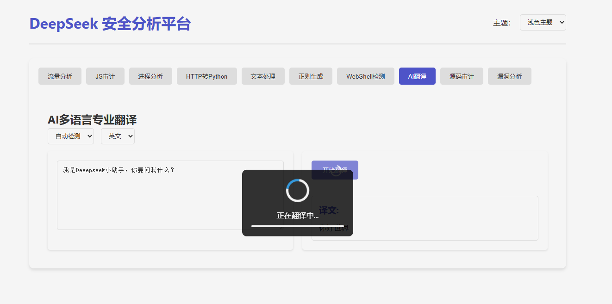

# 基于DeepSeekSelfTool项目进行重构的flask安全分析平台

代码qt5版本来源于：https://github.com/ChinaRan0/DeepSeekSelfTool

原版本来源于：知攻善防实验室公众号

基于此版本，哥们先重构成flask运行，可以移植到更多的地方进行利用和学习。

本项目仅供学习，请勿有任何二次封装盈利的行为，具体行为规范查看原project和知攻善防实验室公众号

## 为什么要多此一举？
- 因为大伙（单指我）比较了解css等等，所以可以很轻松的自行改字号、颜色等
- html修改比较快速，可以直接按照样例继续写入你需要的功能
- 封装成一个后端平台可以轻松接入网站等地方，可能未来的我需要，所以就搞了这个重构
- 还是那句话，现在AI就是生产力工具


## 具体功能
这是一个基于Flask的安全分析平台，提供多种安全分析功能，包括流量分析、JS审计、进程分析等。

具体功能详细查看知攻善防实验室的公众号

tips：
- 线上 api 模型推荐 DeepSeekV3 （不要使用 R1 推理模型，会有多余的输出且非常慢。）
- 且勿提交过长token的文本
## 安装步骤

1. 克隆项目到本地：
```bash
git clone https://github.com/FoLaJJ/Flask-DeepSeekSelfTool.git
cd Flask-DeepSeekSelfTool
```


2. 安装依赖：（或许你需要虚拟环境）
```bash
pip install -r requirements.txt
```

3. 配置API密钥：
- 在`config.py`中填入你的DeepSeek API密钥
```text
API密钥样式:sk-xxxxxxxxxxxxxxxxxxxxxxxxxxxxxxxxxxxx
```

## 运行应用

1. 启动Flask应用：
```bash
python app.py
```

2. 在浏览器中访问：
```
http://localhost:5000
```

## 重构页面
计算token，其中参考了官方模型的大致计算方法


具体效果


浅色主题


深色主题


一个等待功能


解码功能


写报告


webshell检测


正常流量


## 版本修改
- 2025.3.17 重构项目，增加响应
- 2025.3.18 增加本地粗略计算token数量的js（可自定义）
- 2025.4.8 增加对openrouter的支持

## 许可证

MIT License